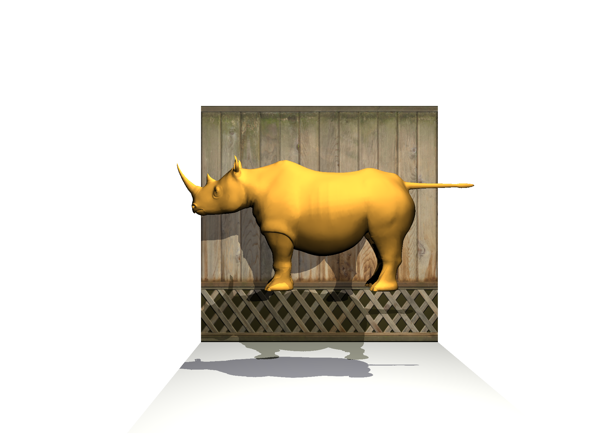

# Shadow




---

**CSC_4IG03_TP** Fundamentals of Computer Graphics, Fall 2024

Implementation of Loop Subdivision algorithm for mesh smoothing and subdivision, using OpenGL. 

---


## File Structure

```
.
├── dep
├── data
├── src/
│   ├── main.cpp                        # Implementation of algorithm
│   └── ...
├── CMakeLists.txt
└── README.md                           # This file
```

## Running the code

The code uses `cmake` as a build system. Run the following commands in the terminal to build and run the project:

```
> cmake -B build    # under the directory where the CMakeLists.txt is located
> make -C build
> ./tpSubdiv        
```

## Controls

### Mouse commands:
- Left button: rotate camera
- Middle button: zoom
- Right button: pan camera
### Keyboard commands:
- H: print this help
- T: toggle animation
- S: save shadow maps into PPM files
- F1: toggle wireframe/surface rendering
- ESC: quit the program
